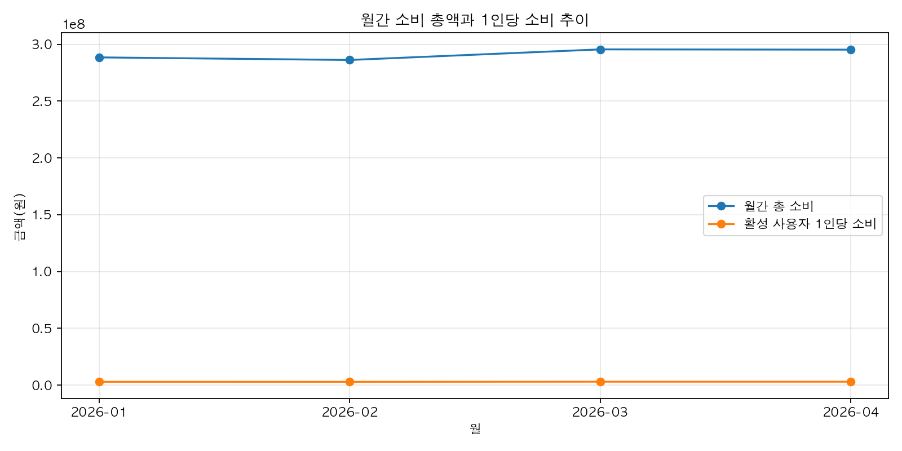
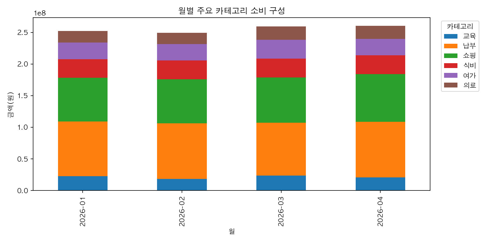
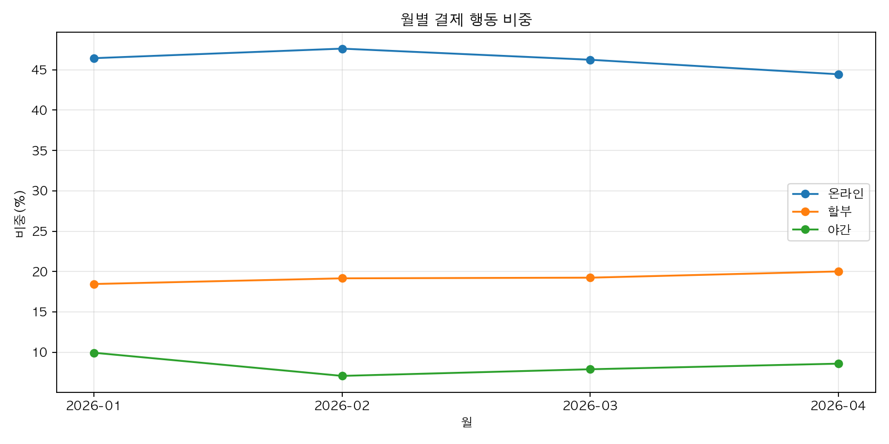
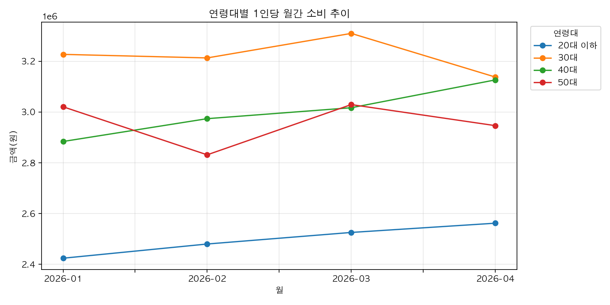

# 사용자 소비 동향 보고서

- 작성일: 2026-04-29  
- 지표 기간: 2026-01-01 ~ 2026-04-30  
- 사용 지표 디렉터리: data/processed/user_trend_metrics/period_2026-01-01_to_2026-04-30

---

## 1. 핵심 요약

2026년 1월부터 4월까지 Catcher 서비스의 활성 사용자 100명을 기준으로 월간 승인 거래 건수는 7,361건에서 7,583건으로 소폭 변동하며, 월간 총 소비액은 2억 8,855만 원에서 2억 9,536만 원 수준을 유지하고 있습니다. 활성 사용자 1인당 평균 소비액은 2,883,000원에서 2,953,000원으로 점진적 상승세를 보였습니다.  

소비 카테고리 중 '납부'가 전체 소비의 약 29.7%를 차지하며 최상위에 위치했고, '쇼핑'(24.5%)과 '식비'(10.1%)가 뒤를 이었습니다. 월별 소비 총액은 1월 대비 3월에 3.25% 증가했으나 4월에는 거의 변동이 없었습니다.  

사용자 목표 지출 대비 예산 사용률은 평균 158% 내외로, 목표 대비 초과 소비가 지속되고 있으며, 150% 이상 초과 사용자는 91명, 300% 이상 초과 사용자는 15명으로 나타나 위험군 관리가 필요합니다.

---

## 2. 월별 동향

| 월    | 승인 거래 건수 | 총 소비액 (KRW) | 전월 대비 증감률(%) | 1인당 평균 소비액 (KRW) | 예산 사용률 (%) | 온라인 결제 비중 (%) | 할부 결제 비중 (%) | 야간 소비 비중 (%) | 최상위 카테고리 | 최상위 카테고리 비중 (%) |
|-------|----------------|-----------------|---------------------|-------------------------|-----------------|---------------------|--------------------|--------------------|-----------------|--------------------------|
| 2026-01 | 7,361          | 288,556,600     | -                   | 2,885,566               | 154.72          | 46.43               | 18.46              | 9.94               | 납부            | 29.97                    |
| 2026-02 | 7,640          | 286,277,700     | -0.79               | 2,862,777               | 153.50          | 47.62               | 19.16              | 7.07               | 납부            | 30.63                    |
| 2026-03 | 7,746          | 295,595,800     | 3.25                | 2,955,958               | 158.50          | 46.24               | 19.24              | 7.89               | 납부            | 28.27                    |
| 2026-04 | 7,583          | 295,368,600     | -0.08               | 2,953,686               | 158.37          | 44.44               | 20.01              | 8.59               | 납부            | 29.77                    |

- 월별 승인 거래 건수는 1월 대비 3월에 소폭 증가했으나 4월에 다소 감소했습니다.  
- 총 소비액은 3월에 2억 9,559만 원으로 최고치를 기록했고 4월에는 거의 유지되었습니다.  
- 온라인 결제 비중은 1월 46.4%에서 4월 44.4%로 소폭 감소했으나 할부 결제 비중은 18.5%에서 20.0%로 증가했습니다.  
- 야간 소비 비중은 1월 9.94%에서 4월 8.59%로 다소 감소했으나 여전히 7~9% 수준을 유지합니다.

---

## 3. 카테고리 구조

| 카테고리 | 총 소비액 (KRW) | 평균 비중 (%) | 활성 사용자 비율 (%) | 거래 건수 |
|----------|-----------------|---------------|---------------------|-----------|
| 납부     | 345,669,100     | 29.66         | 100                 | 4,298     |
| 쇼핑     | 286,206,600     | 24.55         | 100                 | 5,757     |
| 식비     | 117,995,100     | 10.12         | 100                 | 8,131     |
| 여가     | 108,552,900     | 9.31          | 98.75               | 2,260     |
| 교육     | 85,345,400      | 7.32          | 97.25               | 1,613     |
| 의료     | 77,483,100      | 6.64          | 98                  | 1,757     |
| 교통     | 48,441,800      | 4.16          | 100                 | 2,883     |
| 사교     | 37,317,900      | 3.20          | 99                  | 1,910     |
| 해외     | 35,988,400      | 3.09          | 54.75               | 308       |
| 생활     | 22,798,400      | 1.96          | 97                  | 1,413     |

- 납부 카테고리가 전체 소비액의 약 30%를 차지하며 가장 큰 비중을 차지합니다.  
- 쇼핑과 식비가 각각 24.5%, 10.1%로 뒤를 잇고 있어 일상 소비와 필수 지출이 주를 이룹니다.  
- 해외 소비는 전체의 3.1%로 낮은 편이며, 활성 사용자 비율도 54.75%로 상대적으로 적습니다.

### 1월 대비 4월 카테고리별 변화

| 카테고리 | 4월 소비액 (KRW) | 4월 비중 (%) | 1월 소비액 (KRW) | 1월 비중 (%) | 금액 증감 (KRW) | 비중 증감 (포인트) |
|----------|------------------|--------------|------------------|--------------|-----------------|--------------------|
| 쇼핑     | 75,189,200       | 25.46        | 69,287,800       | 24.01        | +5,901,400      | +1.44              |
| 의료     | 20,740,700       | 7.02         | 18,363,000       | 6.36         | +2,377,700      | +0.66              |
| 사교     | 9,879,700        | 3.34         | 7,877,000        | 2.73         | +2,002,700      | +0.62              |
| 납부     | 87,939,100       | 29.77        | 86,491,200       | 29.97        | +1,447,900      | -0.20              |
| 식비     | 30,048,900       | 10.17        | 29,112,300       | 10.09        | +936,600        | +0.08              |
| 생활     | 6,388,500        | 2.16         | 5,514,800        | 1.91         | +873,700        | +0.25              |
| 여가     | 25,606,200       | 8.67         | 26,555,700       | 9.20         | -949,500        | -0.53              |
| 교통     | 11,352,900       | 3.84         | 12,539,200       | 4.35         | -1,186,300      | -0.50              |
| 교육     | 20,784,300       | 7.04         | 22,564,300       | 7.82         | -1,780,000      | -0.78              |
| 해외     | 7,439,100        | 2.52         | 10,251,300       | 3.55         | -2,812,200      | -1.03              |

- 쇼핑, 의료, 사교, 식비, 생활 카테고리에서 소비가 증가한 반면, 여가, 교통, 교육, 해외 카테고리에서는 감소가 관찰됩니다.  
- 특히 해외 소비는 1월 대비 27.4% 감소하며 비중도 1.03%p 하락했습니다.

---

## 4. 결제 행동

- 온라인 결제 비중은 1월 46.4%에서 4월 44.4%로 소폭 감소했으나 여전히 전체 소비의 절반 가까이를 차지합니다.  
- 할부 결제 비중은 18.5%에서 20.0%로 증가해 할부 이용이 점차 늘어나는 추세입니다.  
- 야간 소비(22시 이후)는 1월 9.94%에서 4월 8.59%로 다소 감소했으나 여전히 7~9% 수준의 소비가 야간에 발생하고 있습니다.  
- 월별 결제 행동 비율 변화는 아래 차트에서 확인할 수 있습니다.

---

## 5. 세그먼트별 관찰

| 연령대 및 성별 | 총 소비액 (KRW) | 1인당 평균 소비액 (KRW) | 활성 사용자 수 | 예산 사용률 (%) |
|----------------|-----------------|-------------------------|----------------|-----------------|
| 40대 남성      | 235,514,200     | 3,463,444               | 17             | 162.42          |
| 30대 남성      | 78,582,400      | 3,274,267               | 6              | 144.03          |
| 30대 여성      | 114,135,700     | 3,170,436               | 9              | 146.70          |
| 50대 남성      | 188,665,200     | 3,144,420               | 15             | 161.42          |
| 50대 여성      | 177,266,500     | 2,769,789               | 16             | 169.15          |
| 40대 여성      | 142,106,700     | 2,537,620               | 14             | 152.48          |
| 20대 이하 남성 | 100,798,200     | 2,519,955               | 10             | 156.81          |
| 20대 이하 여성 | 128,729,800     | 2,475,573               | 13             | 143.86          |

- 40대 남성과 50대 남성 세그먼트가 가장 높은 1인당 평균 소비액(약 3.1~3.5백만 원)과 예산 사용률(161~162%)을 보입니다.  
- 50대 여성은 예산 사용률이 169.15%로 가장 높아 목표 대비 초과 소비가 심한 편입니다.  
- 20대 이하 여성과 남성은 평균 소비액은 낮으나 예산 사용률은 각각 143.9%, 156.8%로 비교적 높은 편입니다.

---

## 6. 사용자 위험군

- 목표 예산 사용률 100% 이상인 사용자-월은 396건, 150% 이상은 223건, 200% 이상은 100건, 300% 이상은 20건으로 집계되었습니다.  
- 300% 이상 초과 사용자는 15명으로, 이들은 월간 소비액이 1,550,000원 이상이며 주로 '납부' 카테고리에 집중되어 있습니다.  
- 이들은 할부 비중이 0.1%에서 51.2%까지 다양하며, 마찰 없는 소비 비중도 28.7%에서 92.5%까지 폭넓게 나타납니다.

---

## 7. 주간 및 일간 피크

### 주간 피크 (상위 5주)

| 주 시작일    | 주 종료일    | 총 소비액 (KRW) | 주말 소비 비중 (%) | 주말 과소비 지수 |
|--------------|--------------|-----------------|--------------------|------------------|
| 2026-04-20   | 2026-04-26   | 79,921,300      | 33.52              | 1.26             |
| 2026-02-09   | 2026-02-15   | 79,874,000      | 34.94              | 1.34             |
| 2026-01-19   | 2026-01-25   | 78,187,300      | 40.39              | 1.69             |
| 2026-03-23   | 2026-03-29   | 77,716,600      | 29.62              | 1.05             |
| 2026-01-05   | 2026-01-11   | 76,620,500      | 37.15              | 1.48             |

- 1월과 2월 중순에 주말 소비 비중과 과소비 지수가 높아 주말 소비 집중 현상이 뚜렷합니다.

### 일간 피크 (상위 5일)

| 날짜        | 총 소비액 (KRW) | 온라인 결제 비중 (%) | 야간 소비 비중 (%) |
|-------------|-----------------|---------------------|--------------------|
| 2026-04-20  | 26,125,600      | 59.42               | 2.56               |
| 2026-03-25  | 25,898,400      | 56.24               | 2.17               |
| 2026-01-25  | 25,296,300      | 53.51               | 0.53               |
| 2026-02-20  | 24,698,700      | 62.07               | 2.37               |
| 2026-02-25  | 24,089,700      | 58.18               | 3.81               |

- 특정 일자에 소비가 집중되며, 온라인 결제 비중이 50% 이상으로 높고 야간 소비 비중은 0.5%~3.8% 사이입니다.

---

## 8. LLM 활용 포인트

- 월별 소비 패턴과 카테고리별 증감 추이를 기반으로 개인별 맞춤 예산 조정 및 소비 경고 메시지 생성에 활용 가능  
- 위험군 사용자(예산 사용률 150% 이상)에 대한 자동 탐지 및 맞춤형 금융 상담 챗봇 서비스 제공  
- 주말 및 야간 소비 집중 현상을 분석하여 시간대별 소비 패턴 예측 및 프로모션 타이밍 최적화  
- 세그먼트별 소비 특성을 반영한 맞춤형 마케팅 캠페인 기획 지원

---

## 9. 권장 액션

1. **위험군 관리 강화**  
   - 예산 사용률 150% 이상 사용자에 대한 집중 모니터링 및 맞춤형 소비 조절 가이드 제공  
   - 300% 이상 초과 사용자의 소비 패턴 분석 및 긴급 알림 시스템 도입 검토

2. **카테고리별 소비 증감 대응**  
   - 쇼핑, 의료, 사교 카테고리 소비 증가에 따른 프로모션 및 할인 정책 검토  
   - 해외, 교육, 교통, 여가 카테고리 소비 감소 원인 분석 및 활성화 전략 수립

3. **결제 방식 다변화 대응**  
   - 할부 결제 비중 증가에 따른 리스크 관리 및 할부 상품 관련 사용자 교육 강화  
   - 온라인 결제 비중 감소 추세에 대응한 오프라인 결제 편의성 개선 방안 마련

4. **시간대별 소비 패턴 활용**  
   - 주말 및 야간 소비 집중 현상을 활용한 타겟 마케팅 및 프로모션 진행  
   - 야간 소비 비중이 높은 사용자 대상 맞춤형 금융 상품 제안

5. **LLM 기반 개인화 서비스 확대**  
   - 개인별 소비 패턴 분석을 통한 맞춤형 예산 관리 및 소비 습관 개선 서비스 개발  
   - 위험군 사용자에 대한 자동화된 상담 및 경고 메시지 시스템 구축

---

본 보고서는 Catcher 서비스의 2026년 1분기부터 4월까지 사용자 소비 데이터를 종합 분석하여 작성되었습니다. 지속적인 모니터링과 맞춤형 대응을 통해 사용자 만족도 및 서비스 경쟁력 강화를 기대합니다.
