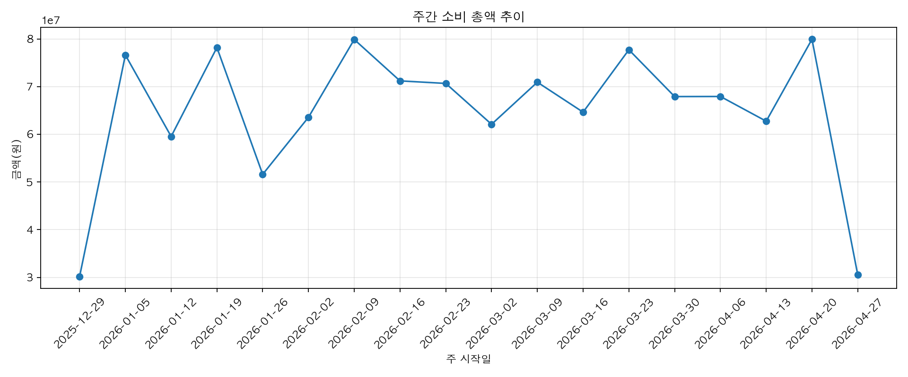

# 사용자 소비 동향 보고서

- 작성일: 2026-04-29
- 분석 기간: 2026-01-01 ~ 2026-04-30
- 사용 지표: `data/processed/user_trend_metrics`
- 사용 데이터: `data/raw/csv/users_v3.csv`, `data/raw/csv/transactions_v3.csv`
- 해석 기준: 승인 거래(`APPROVED`) 중심. 취소 거래는 월별 취소 건수로 별도 집계.

## 1. 핵심 요약

2026년 1월부터 4월까지 100명 전원이 매월 소비 활동을 보였고, 4개월 승인 소비 총액은 1,165,798,700원이다. 월평균 승인 소비 총액은 291,449,675원이며, 2026-04 총액은 2026-01 대비 6,812,000원 증가해 2.36% 상승했다.

전체 소비는 큰 폭으로 흔들리기보다 높은 수준에서 유지되는 흐름이다. 2026-02에는 전월 대비 -0.79% 줄었지만, 2026-03에 +3.25% 반등했고 2026-04에는 -0.08%로 거의 유지됐다. 사용자 1인당 월간 소비도 286만~296만 원 구간에 머물러 총액 변화보다 소비 구조 변화가 더 중요한 신호다.

가장 큰 카테고리는 모든 월에서 `납부`였다. 4개월 합산 납부 금액은 345,669,100원이고 평균 구성비는 29.66%다. 그 다음은 `쇼핑` 286,206,600원, 평균 구성비 24.55%다. 납부와 쇼핑만 합쳐도 전체 소비의 절반 이상을 차지하므로, LLM이 동향을 설명할 때는 이 두 축을 먼저 잡아야 한다.

목표 지출 한도 대비 사용률은 매월 153.5%~158.5%로 목표를 꾸준히 초과한다. 사용자-월 400건 중 396건이 목표의 100% 이상이고, 100건은 200% 이상, 20건은 300% 이상이다. 이 데이터에서는 과소비가 일부 예외 사용자만의 문제가 아니라 전반적인 기본 상태에 가깝다.

## 2. 월별 동향

| 월 | 활성 사용자 | 승인 거래 | 승인 소비 총액 | 전월 대비 | 1인당 소비 | 목표 사용률 | 온라인 비중 | 할부 비중 | 야간 비중 | 1위 카테고리 |
| --- | ---: | ---: | ---: | ---: | ---: | ---: | ---: | ---: | ---: | --- |
| 2026-01 | 100 | 7,361 | 288,556,600원 | - | 2,885,566원 | 154.72% | 46.43% | 18.46% | 9.94% | 납부 29.97% |
| 2026-02 | 100 | 7,640 | 286,277,700원 | -0.79% | 2,862,777원 | 153.50% | 47.62% | 19.16% | 7.07% | 납부 30.63% |
| 2026-03 | 100 | 7,746 | 295,595,800원 | +3.25% | 2,955,958원 | 158.50% | 46.24% | 19.24% | 7.89% | 납부 28.27% |
| 2026-04 | 100 | 7,583 | 295,368,600원 | -0.08% | 2,953,686원 | 158.37% | 44.44% | 20.01% | 8.59% | 납부 29.77% |

월별 핵심 변화는 3가지다.

첫째, 총액은 2026-03부터 2.95억 원대에 올라온 뒤 2026-04에도 유지됐다. 2026-04의 거래 건수는 2026-03보다 줄었지만 총액은 거의 유지되어, 건당 평균 결제액이 38,161원에서 38,951원으로 올라갔다.

둘째, 온라인 결제 비중은 2026-02 47.62%에서 2026-04 44.44%로 내려갔다. 온라인 의존이 낮아졌다고 볼 수 있지만, 여전히 전체 소비의 40% 중반을 차지하므로 결제 편의성 기반 소비는 주요 설명 변수다.

셋째, 할부 비중은 18.46%에서 20.01%로 상승했다. 총액이 급증하지 않는 상황에서 할부 비중이 올라가는 것은 현재 소비보다 다음 달 이후 부담이 커질 가능성을 시사한다.

## 3. 카테고리 구조

| 순위 | 카테고리 | 4개월 합산 금액 | 평균 구성비 | 월평균 이용 사용자 | 거래 건수 |
| ---: | --- | ---: | ---: | ---: | ---: |
| 1 | 납부 | 345,669,100원 | 29.66% | 100.00명 | 4,298 |
| 2 | 쇼핑 | 286,206,600원 | 24.55% | 100.00명 | 5,757 |
| 3 | 식비 | 117,995,100원 | 10.12% | 100.00명 | 8,131 |
| 4 | 여가 | 108,552,900원 | 9.31% | 98.75명 | 2,260 |
| 5 | 교육 | 85,345,400원 | 7.32% | 97.25명 | 1,613 |
| 6 | 의료 | 77,483,100원 | 6.64% | 98.00명 | 1,757 |
| 7 | 교통 | 48,441,800원 | 4.16% | 100.00명 | 2,883 |
| 8 | 사교 | 37,317,900원 | 3.20% | 99.00명 | 1,910 |
| 9 | 해외 | 35,988,400원 | 3.09% | 54.75명 | 308 |
| 10 | 생활 | 22,798,400원 | 1.96% | 97.00명 | 1,413 |

2026-01에서 2026-04로 이동하며 가장 많이 증가한 카테고리는 쇼핑이다. 쇼핑은 69,287,800원에서 75,189,200원으로 5,901,400원 증가했고 구성비도 24.01%에서 25.46%로 1.44%p 상승했다. 납부가 가장 큰 카테고리이지만, 최근 증가 신호는 쇼핑에서 더 선명하다.

의료는 2,377,700원 증가했고 구성비도 0.66%p 올랐다. 사교도 2,002,700원 증가해 2026-04에는 월초 대비 확대됐다. 반대로 해외는 2,812,200원 감소했고 구성비는 3.55%에서 2.52%로 낮아졌다. 교육과 교통도 감소했다.

따라서 LLM 보고서의 우선 해석은 “전체 소비가 급등했다”보다 “총액은 높은 수준에서 유지되고, 내부 구성은 쇼핑·의료·사교 쪽으로 조금 이동했다”가 더 정확하다.

## 4. 결제 행동과 부담 신호

| 지표 | 2026-01 | 2026-02 | 2026-03 | 2026-04 | 해석 |
| --- | ---: | ---: | ---: | ---: | --- |
| 온라인 결제 비중 | 46.43% | 47.62% | 46.24% | 44.44% | 40% 중반 유지, 4월에는 완만한 하락 |
| 할부 결제 비중 | 18.46% | 19.16% | 19.24% | 20.01% | 매월 상승, 미래 부담 신호 |
| 해외 결제 비중 | 3.55% | 3.25% | 3.04% | 2.52% | 지속 하락 |
| 야간 소비 비중 | 9.94% | 7.07% | 7.89% | 8.59% | 1월 고점 후 낮아졌지만 4월 재상승 |

할부 비중 상승은 가장 중요한 결제 행동 신호다. 2026-04에는 승인 소비 총액이 전월과 거의 같았지만 할부 비중은 20.01%로 4개월 중 최고다. “소비 총액이 유지됐으니 안정”이라고 해석하면 안 되고, 결제 구조가 미래 현금흐름을 더 잠식하는 방향인지 확인해야 한다.

온라인 비중은 소폭 하락했지만 사용자-월 기준 지출 마찰력 비중 평균은 50.23%다. 사용자-월 54건은 마찰 없는 결제 비중이 70% 이상이다. 이 그룹에는 예산 총액보다 결제 전 확인 장치, 앱 결제 알림, 고액 결제 지연 규칙 같은 행동 제어형 피드백이 적합하다.

할부 비중이 30% 이상인 사용자-월은 68건이다. 이 그룹은 단순 절약 메시지보다 할부 신규 발생 억제, 납부 예정액 확인, 다음 달 카드값 시뮬레이션이 우선이다.

## 5. 세그먼트별 관찰

| 세그먼트 | 4개월 합산 금액 | 월평균 1인당 소비 | 평균 목표 사용률 | 해석 |
| --- | ---: | ---: | ---: | --- |
| 40대 남성 | 235,514,200원 | 3,463,444원 | 162.42% | 규모와 1인당 소비가 모두 가장 큼 |
| 30대 남성 | 78,582,400원 | 3,274,267원 | 144.03% | 인원은 적지만 1인당 소비가 높음 |
| 30대 여성 | 114,135,700원 | 3,170,436원 | 146.70% | 높은 1인당 소비, 중간 수준 예산 초과 |
| 50대 남성 | 188,665,200원 | 3,144,420원 | 161.42% | 납부·고정성 소비 부담 점검 필요 |
| 50대 여성 | 177,266,500원 | 2,769,789원 | 169.15% | 목표 사용률이 가장 높음 |
| 40대 여성 | 142,106,700원 | 2,537,620원 | 152.48% | 총액보다 예산 초과 관리가 중요 |
| 20대 이하 남성 | 100,798,200원 | 2,519,955원 | 156.81% | 목표 대비 초과 상태 |
| 20대 이하 여성 | 128,729,800원 | 2,475,573원 | 143.86% | 1인당 소비는 가장 낮지만 목표 초과 |

40대 남성은 사용자 수가 17명이고 4개월 합산 소비가 235,514,200원으로 가장 크다. 서비스 전체 KPI를 움직이는 캠페인이나 알림 실험은 이 세그먼트의 반응을 별도로 추적하는 편이 좋다.

50대 여성은 월평균 1인당 소비가 2,769,789원으로 최상위는 아니지만 평균 목표 사용률이 169.15%로 가장 높다. 총액 절대값보다 개인별 목표 대비 초과 관점에서 관리해야 한다.

30대 남성은 사용자 수가 6명으로 작지만 월평균 1인당 소비가 3,274,267원이다. 표본 규모가 작으므로 일반화는 조심해야 하지만, 고소비 사용자군 탐색 대상으로는 유효하다.

## 6. 사용자 위험군

| 기준 | 사용자-월 건수 | 고유 사용자 수 | 의미 |
| --- | ---: | ---: | --- |
| 목표 사용률 100% 이상 | 396 | 100 | 거의 모든 사용자-월이 목표 초과 |
| 목표 사용률 150% 이상 | 223 | 91 | 다수 사용자가 반복적으로 초과 |
| 목표 사용률 200% 이상 | 100 | 45 | 집중 관리가 필요한 초과군 |
| 목표 사용률 300% 이상 | 20 | 15 | 즉시 알림·개별 피드백 우선군 |

목표 사용률 200% 이상 사용자-월은 2026-01 27건, 2026-02 21건, 2026-03 26건, 2026-04 26건이다. 2월에 줄었다가 3~4월에 다시 26건 수준으로 유지되어 고위험군이 구조적으로 남아 있다.

상위 위험 사용자-월은 다음과 같다.

| 사용자 | 월 | 월 소비 | 목표 사용률 | 최대 카테고리 | 할부 비중 | 마찰 없는 결제 비중 |
| ---: | --- | ---: | ---: | --- | ---: | ---: |
| 60 | 2026-04 | 2,006,400원 | 401.28% | 납부 | 10.35% | 74.07% |
| 43 | 2026-02 | 1,902,200원 | 380.44% | 납부 | 32.24% | 61.26% |
| 39 | 2026-02 | 1,815,700원 | 363.14% | 납부 | 7.68% | 76.04% |
| 34 | 2026-04 | 1,688,600원 | 337.72% | 납부 | 9.77% | 60.23% |
| 31 | 2026-04 | 1,682,400원 | 336.48% | 납부 | 51.17% | 55.86% |
| 47 | 2026-04 | 1,681,100원 | 336.22% | 납부 | 27.16% | 76.27% |

고위험군의 최대 카테고리는 대부분 납부다. 따라서 “쇼핑 줄이기”만으로는 설명력이 부족하다. 납부·할부·마찰 없는 결제 비중을 함께 보여주고, 이번 달 소비 통제와 다음 달 결제 부담 관리를 분리해야 한다.

## 7. 주간·일간 피크

| 구분 | 기간/일자 | 소비 총액 | 특징 |
| --- | --- | ---: | --- |
| 주간 1위 | 2026-04-20 ~ 2026-04-26 | 79,921,300원 | 4개월 중 최고 주간 소비 |
| 주간 2위 | 2026-02-09 ~ 2026-02-15 | 79,874,000원 | 주말 소비 비중 34.94% |
| 주간 3위 | 2026-01-19 ~ 2026-01-25 | 78,187,300원 | 주말 과소비 지수 1.69 |
| 일간 1위 | 2026-04-20 | 26,125,600원 | 온라인 비중 59.42% |
| 일간 2위 | 2026-03-25 | 25,898,400원 | 온라인 비중 56.24% |
| 일간 3위 | 2026-01-25 | 25,296,300원 | 건당 평균 66,921원 |

피크 주간은 2026-04-20 주간이다. 이 주간은 4월 전체가 전월 대비 거의 유지되는 상황에서도 특정 주에 소비가 몰린 사례다. 월간 지표만 보면 평온해 보이지만 주간 단위에서는 급등 구간이 존재한다.

일간 최고 소비일인 2026-04-20은 온라인 비중이 59.42%다. 피크 일자에서 온라인 비중이 높다는 점은 결제 편의성과 고액일의 관계를 추가로 봐야 한다는 신호다.

## 8. LLM 동향 설명용 포인트

LLM이 이 지표를 사용해 사용자 동향을 설명할 때는 다음 순서가 적합하다.

1. 먼저 “총액은 2026-03 이후 2.95억 원대에서 유지”라고 설명한다.
2. 이어 “목표 사용률은 매월 150% 이상으로 전반적인 예산 초과 상태”라고 진단한다.
3. 카테고리는 “납부가 가장 크고, 최근 증가는 쇼핑·의료·사교에서 관찰”이라고 구분한다.
4. 결제 행동은 “온라인 비중은 여전히 높고, 할부 비중은 계속 상승”으로 요약한다.
5. 위험군은 “목표 200% 이상 사용자-월 100건, 목표 300% 이상 20건”을 별도 관리 대상으로 분리한다.
6. 세그먼트는 “40대 남성이 전체 규모를, 50대 여성이 목표 초과율을 주도”한다고 설명한다.

## 9. 권장 액션

첫 화면 KPI는 `월간 총액`, `목표 사용률`, `납부+쇼핑 비중`, `할부 비중` 4개를 우선 배치하는 것이 좋다. 이 조합이 현재 데이터의 핵심 변화를 가장 적게 왜곡한다.

월간 피드백은 납부와 쇼핑을 분리해야 한다. 납부는 고정성·반복성·미래 부담 관점으로, 쇼핑은 조절 가능한 소비와 결제 지연 규칙 관점으로 설명해야 한다.

고위험 사용자군에는 목표 초과율만 보여주지 말고 `최대 카테고리`, `할부 비중`, `마찰 없는 결제 비중`을 같이 제공해야 한다. 같은 300% 초과라도 납부 중심인지, 쇼핑 중심인지, 할부 중심인지에 따라 행동 제안이 달라진다.

주간 피크 알림은 월간 보고서와 별도로 운영할 가치가 있다. 2026-04는 월간 총액이 전월과 거의 같지만 2026-04-20 주간은 최고 소비 주간이었다. 월간 안정 신호가 주간 급등을 가릴 수 있다.

## 부록. 산출 지표 파일

| 파일 | 용도 |
| --- | --- |
| `llm_trend_metrics.csv` | LLM이 바로 읽기 쉬운 long-form 월별 핵심 지표 |
| `monthly_trends.csv` | 월별 총액, 결제 행동, 목표 사용률, 1위 카테고리 |
| `category_monthly_trends.csv` | 월별 카테고리 금액·구성비·전월 대비 변화 |
| `segment_monthly_trends.csv` | 연령대·성별 월간 세그먼트 소비 |
| `user_monthly_metrics.csv` | 사용자-월별 목표 사용률, 최대 카테고리, 할부·마찰 없는 결제 비중 |
| `weekly_trends.csv` | 주간 소비 총액, 주중·주말 소비 비중 |
| `daily_trends.csv` | 일간 소비 총액, 온라인·야간 소비 비중 |
